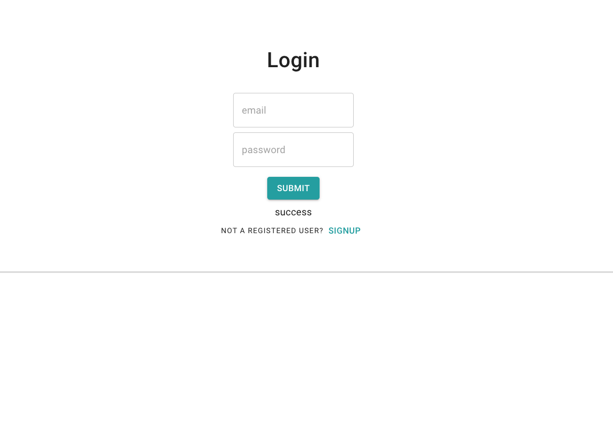

# News Fix

## Description
News Fix is an app that gives a user the ability to see real time top news stories, which can be filtered by categories. A user can also save articles of interest to their accounts favorites, as well as delete them once they are done reading.

### Technologies
- Express
- Node.js
- React
- Typescript
- TypeOrm
- Postgresql
- React Router
- Redux Toolkit
- News API

# Architecture

I utilized a Model View Controller architectural pattern to structure my app.

### Models 
My models are Entities specified by typeorm which provide a schema for my database to work with.

 - Users
 - Articles
 - Favorites

### Views
My views are react components which 
are navigated to as pages with react router.

- Landing Page
- News Page
- Favorites
- Logout

### Controllers
My controllers serve as the go between from my frontend views and my database.

- Auth Controller
- Favorites Controller

## Server Side Overview

### Enitity Relationships
many to many relationship

### API Endpoints
#### GET
 `/:userId/favorites`
 #### POST
  `/login` \
 `/signup` \
 `/:userId/favorites`
 #### DELETE    
`/:userId/favorites/:articleId`

## Client Side Overview
 
 ### Frontend routes
  `loginorsignup` - renders a landing page with a form for signing up or logging in. Form state is handled by Formik 

`/` - the home route renders the life news feed which is pulled in from the [News API](https://newsapi.org/docs)
 
 `favorties` - renders a page populated with a logged in users favorires pulled in from a backend API call.

`logout` - renders a button to logout and redirect the user back to the landing page.

### MUI Components
- Tabs
- Cards
- AppBar 

# User Flow

1. When you open the app you will be shown a Login Page. \
     If you have an account you can enter your email and password, otherwise you can click the SignUp link which will direct you to a sign up form.

    

  
2. After you click submit you will be redirected to a News Feed which shows you the top headlines in the United States from multiple sources.\
You can click on the tabs on the left to view stories in a specific category. If you'd like to save a story to your favorites you can click the 'Add to Favorites' button on a news card.
        

    
3. Click on the Favorites link the Navbar to go to your favorited stories. \
    If you'd like to delete a story from your favorites click on the trash can icon on a favorited news card.
    If you'd like to read more, click on the 'go to story' link and you will be directed to leave the app and read the article from its source.

    

4. Click on the Logout link in the navbar which will direct you to a page with a Logout button. After you click the button you will be directed back to the login page.

    